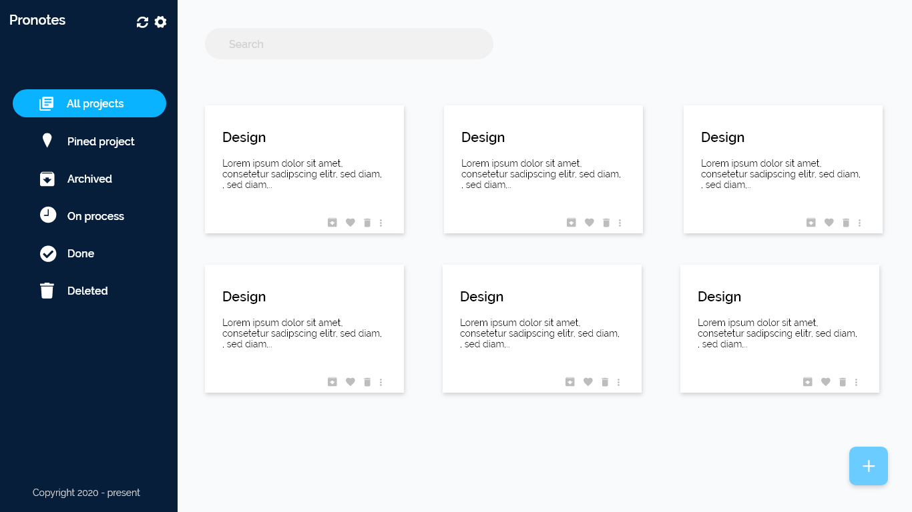

# Makeit

This is project to help managing side project, minimal website for some website like trello or clickup,etc...

## To contribute to this project ?

### `forke the project [Judionit/makeit](https://github.com/Judioni/makeit)`
### `clone your forked project`
### `cd makeit`
### `yarn start`

